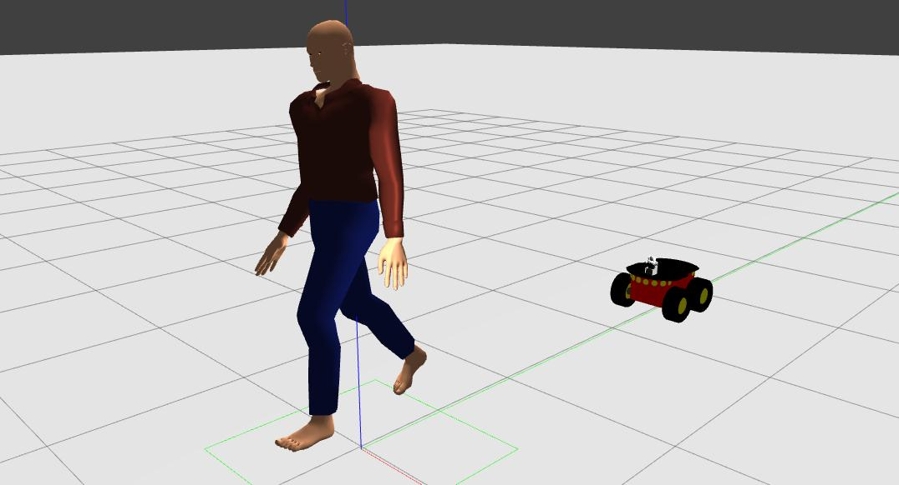
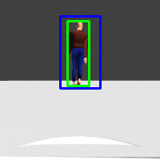

<h1 align="center"> Projeto Desenvolvido para o Trabalho de Conclusão de Curso </h1>

# Controlador Baseado em Aprendizado por Reforço para
Robos Seguidores de Pessoas.  

  <a href="#-tecnologias">Tecnologias</a>&nbsp;&nbsp;&nbsp;

 

Este trabalho propoe uma técnica de rastreamento e acompanhamento de pessoas por meio de robôs seguidores, utilizando aprendizado por reforço. A abordagem baseia-se no algoritmo Deep Q-Network (DQN), que combina aprendizado por reforço e redes neurais profundas. A implementação consiste em um ambiente de treinamento customizado e um agente capaz de
aprender a se locomover a partir de um cenario criado no simulador Gazebo.

 

  

O Robô seguindo a Pessoa. 

O espaço de observação neste treinamentoe baseado na detecção da pessoa por meio do componente de camera no ambiente de simulação. A imagem da câmera possui um retângulo fixo e outro móvel que é o resultado da detecção pelo YOLOv4 quando há uma pessoa na cena. A diferença entre os dois retângulos representa o estado que é a entrada da rede neural do algoritmo DQN. O espaço de ações para o robô foi definido como velocidade linear no eixo X e velocidade angular no eixo Z.

 

  

 Perspectiva do Robô.  

O treinamento foi realizado utilizando os codigos gerados para simulação no ambiente Gazebo, Gym e ROS. Foi utilizado a biblioteca numérica TensorFlow para os
cálculos e acompanhamento do resultado.

## 🚀 Tecnologias

Esse projeto foi desenvolvido com as seguintes tecnologias:

- Robótica
- Python
- ROS
- OpenAI Gym
- Simulador Gazebo
- Robô Pionner 3 AT
- Aprendizado por Reforço
- Aprendizado de Máquina
- YOLOv4
- Tensorflow
- Visão Computacional

## 📖 

Você pode visualizar e ler através [URI](http://riu.ufam.edu.br/handle/prefix/7014).